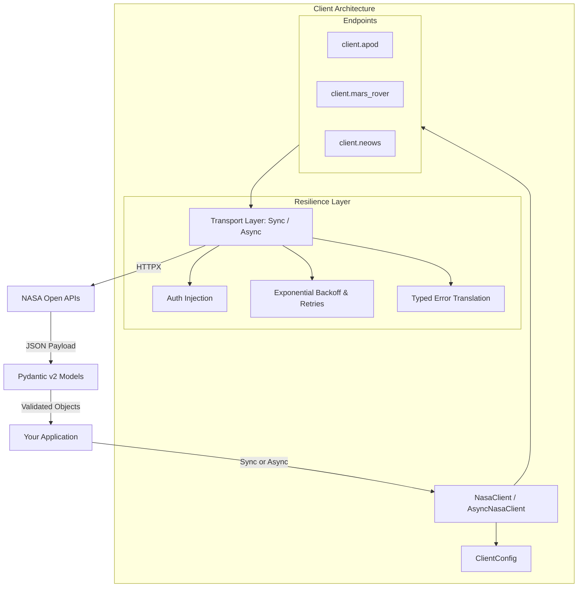

<div align="center">

# 🚀 NASA Python SDK

### *A modern, strongly-typed, and resilient Python client for NASA Open APIs.*

[](https://github.com/your-username/nasa-sdk/actions)
[](https://github.com/your-username/nasa-sdk)
[](https://pypi.org/project/nasa-sdk/)
[](https://docs.pydantic.dev/)
[](https://github.com/astral-sh/ruff)
[](https://mypy-lang.org/)
[](https://opensource.org/licenses/MIT)

<br/>

[Quickstart](#-quickstart) •
[Features](#-key-features) •
[Architecture](#-architecture) •
[API Guide](#-api-guide) •
[Async Concurrency](#-high-concurrency-async) •
[Error Handling](#-resilience--error-handling)

</div>

---

## 🌟 Why NASA SDK?

Fetching raw JSON from NASA's public endpoints usually involves dealing with ad-hoc requests, unhandled `429 Too Many Requests` rate limits, missing schema types, and untracked API errors.

**`nasa-sdk`** turns NASA's Open APIs into a first-class engineering experience:
* ⚡ **Dual Sync & Async Support**: Identical ergonomic APIs for scripts (`NasaClient`) and high-throughput async services (`AsyncNasaClient`).
* 🛡️ **Autonomous Resilience**: Transparent exponential backoff with jitter on HTTP `429` (rate limits) and `5xx` server hiccups.
* 📦 **Strict Type Safety**: Every response is validated into robust **Pydantic v2** models with full IDE autocompletion.
* 🖼️ **Asset Utilities**: Built-in `.download()` and `.adownload()` methods to save high-resolution astronomy wallpapers directly to disk.
* 🔑 **Zero Configuration**: Works immediately with NASA's public `DEMO_KEY`—no account required to start building.

---

## ⚡ Quickstart

### 1. Installation

```bash
pip install nasa-sdk
```

### 2. Grab Today's Astronomy Picture of the Day

```python
from nasa_sdk import NasaClient

with NasaClient() as client:
    apod = client.apod.get()
    print(f"🌌 {apod.title} ({apod.date})")
    print(f"🔗 {apod.url}")
```

*(Optional)* Set your personal API key via environment variable:
```bash
export NASA_API_KEY="your_api_key_here"
```

---

## 🏛️ Architecture



---

## 📖 API Guide

### 1. Astronomy Picture of the Day (APOD)

```python
from nasa_sdk import NasaClient

with NasaClient() as client:
    # 1. Fetch today's APOD
    today = client.apod.get()

    # 2. Fetch specific date
    past = client.apod.get(date="2024-04-08")

    # 3. Explore random cosmic images
    random_photos = client.apod.get_random(count=3)

    # 4. Save high-resolution wallpaper directly to disk
    if today.media_type == "image":
        saved_file = today.download("wallpapers/today.jpg", use_hd=True)
        print(f"Saved wallpaper to {saved_file}")
```

---

### 2. Mars Rover Photos & Mission Manifests

Query photography from **Curiosity**, **Perseverance**, **Opportunity**, and **Spirit**:

```python
with NasaClient() as client:
    # Query photos taken by Curiosity on Martian Sol 1000
    photos = client.mars_rover.get_photos(
        rover="curiosity",
        sol=1000,
        camera="fhaz",  # Front Hazard Avoidance Camera
        page=1,
    )

    for photo in photos:
        print(f"Photo #{photo.id} | Earth Date: {photo.earth_date} | URL: {photo.img_src}")

    # Inspect mission history and status
    manifest = client.mars_rover.get_manifest(rover="perseverance")
    print(f"Perseverance Status: {manifest.status}")
    print(f"Total Martian Sols explored: {manifest.max_sol}")
    print(f"Total Photos taken: {manifest.total_photos:,}")
```

---

### 3. Near-Earth Asteroid Tracking (NeoWs)

Monitor close-approach asteroids and identify potential planetary hazards:

```python
with NasaClient() as client:
    feed = client.neows.feed(start_date="2026-10-04", end_date="2026-10-06")

    print(f"Asteroids detected near Earth: {feed.element_count}")

    for date_str, asteroids in feed.near_earth_objects.items():
        print(f"\nDate: {date_str}")
        for ast in asteroids:
            hazard = "⚠️ HAZARDOUS" if ast.is_potentially_hazardous_asteroid else "✅ Safe"
            print(f" - {ast.name} ({hazard})")
            if ast.estimated_diameter and ast.estimated_diameter.meters:
                diameter = ast.estimated_diameter.meters.estimated_diameter_max
                print(f"   Max Estimated Diameter: {diameter:.1f} meters")
```

---

## ⚡ High-Concurrency Async

For FastAPI, modern backends, or real-time pipelines, use `AsyncNasaClient` to fetch multiple astronomical resources concurrently:

```python
import asyncio
from nasa_sdk import AsyncNasaClient

async def main():
    async with AsyncNasaClient() as client:
        # Launch requests concurrently with asyncio.gather
        apod_coro = client.apod.get()
        mars_coro = client.mars_rover.get_photos(rover="curiosity", sol=1000)
        perseverance_coro = client.mars_rover.get_manifest(rover="perseverance")

        apod, mars_photos, manifest = await asyncio.gather(
            apod_coro, mars_coro, perseverance_coro
        )

        print(f"APOD: {apod.title}")
        print(f"Retrieved {len(mars_photos)} Curiosity images")
        print(f"Perseverance status: {manifest.status}")

asyncio.run(main())
```

---

## 🛡️ Resilience & Error Handling

All HTTP errors are mapped into strongly-typed exceptions inheriting from `NasaError`:

```
NasaError
 ├── ValidationError        (Client-side validation error)
 ├── TimeoutError          (Network timeout after max retries)
 └── NasaAPIError          (API response HTTP 4xx/5xx)
      ├── AuthenticationError (HTTP 401 / 403 - Invalid or missing key)
      ├── NotFoundError       (HTTP 404 - Resource not found)
      ├── RateLimitError      (HTTP 429 - Rate limit exceeded)
      └── ServerError         (HTTP 500-599 - NASA server error)
```

### Automatic Exponential Backoff
When receiving a `429 Rate Limit` or temporary `503 Service Unavailable`, the SDK automatically backs off with exponential delays:

```python
from nasa_sdk import NasaClient, RateLimitError, AuthenticationError

try:
    with NasaClient(max_retries=5, backoff_factor=1.0) as client:
        apod = client.apod.get()
except RateLimitError as exc:
    print(f"Rate limited! Suggested wait time: {exc.retry_after} seconds.")
except AuthenticationError as exc:
    print(f"Invalid API Key: {exc.message}")
```

---

## ⚙️ Advanced Configuration

Fine-tune the client to your network environment:

```python
from nasa_sdk import NasaClient

client = NasaClient(
    api_key="your_custom_key",
    timeout=15.0,              # 15 seconds request timeout
    max_retries=4,             # Retry up to 4 times on transient errors
    backoff_factor=0.5,        # 0.5s, 1s, 2s, 4s backoff schedule
    headers={"X-Custom-Client": "MyAstronomyDashboard"},
)
```

---

## 🧪 Development & Testing

We enforce strict **100% test coverage** and full static typing.

```bash
# Clone and install in editable mode
git clone https://github.com/your-username/nasa-sdk.git
cd nasa-sdk
python -m venv .venv
.\.venv\Scripts\activate
pip install -e ".[dev]"

# Run test suite with coverage enforcement (must be 100%)
pytest

# Run linter and formatting checks
ruff check src tests
ruff format --check src tests

# Run type checker
mypy src
```

---

## 📄 License

This project is licensed under the [MIT License](LICENSE).
NASA API data is provided courtesy of the [NASA Open Data Development Team](https://api.nasa.gov/).
